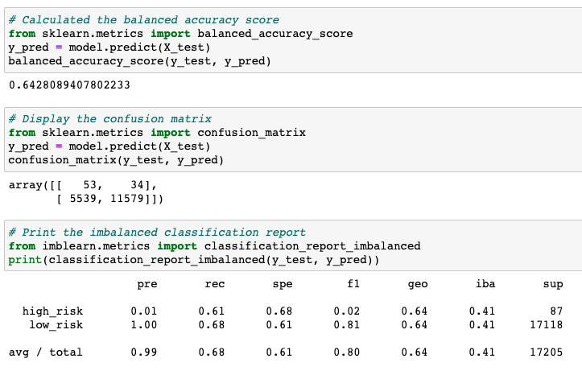
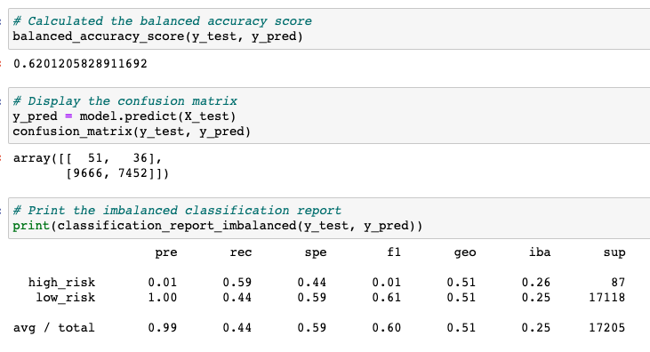
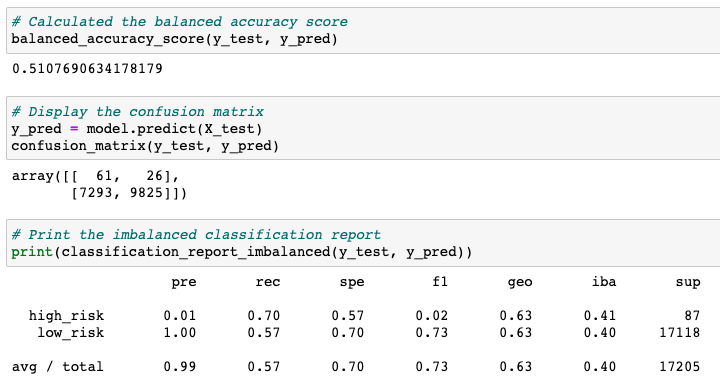
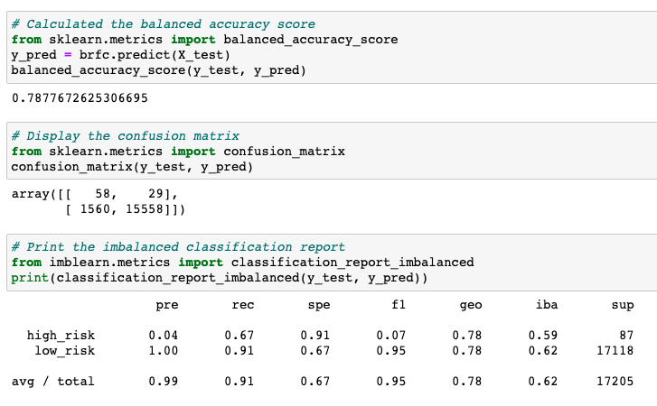
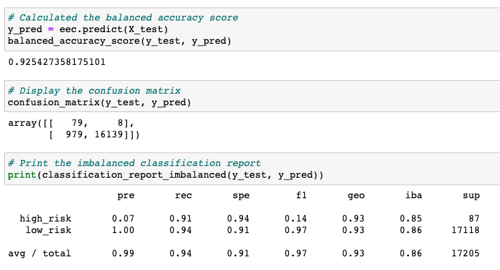

# Credit Risk Analysis

## Overview:
This project utilizes skills in data preparation, statistical reasoning, and supervised machine learning. Utilizing different techniques to train and evaluate models with unbalanced classes, the final result is a recommendation on which model performs best to predict credit risk. All analysis is written in Python.

---
### Resources:
* Source Code: [Credit Risk Ensemble](credit_risk_ensemble.ipynb), [Credit Risk Resampling](credit_risk_resampling.ipynb)
* Source Data: [Loan Stats](LoanStats_2019Q1.csv)
* Technology: [Scikit-Learn](https://scikit-learn.org/stable/), [Imbalanced-Learn](https://imbalanced-learn.org/stable/index.html)

---
### Deliverables:
- [x] Deliverable 1: Use Resampling Models to Predict Credit Risk
- [x] Deliverable 2: Use the SMOTEENN Algorithm to Predict Credit Risk
- [x] Deliverable 3: Use Ensemble Classifiers to Predict Credit Risk
- [x] Deliverable 4: Write Credit Risk Analysis

---
### RandomOverSampler:

    * Accuracy: .6428
    * Precision: 
        * High Risk: .01 
        * Low Risk: 1 
    * Recall:
        * High Risk: .61
        * Low Risk: .68
    * F1:
        * High Risk: .02
        * Low Risk: .81 
    * Benefits: 
        * Instances from the minority class are randomly selected and added to the minority class.
---
### SMOTE:

    * Accuracy: .6201
    * Precision: 
        * High Risk: .01
        * Low Risk: 1 
    * Recall:
        * High Risk: .60
        * Low Risk: .64
    * F1:
        * High Risk: .02
        * Low Risk: .78  
    * Benefits:
        * For an instance from the minority class, a number of its closest neighbors is chosen. Based on the values of these neighbors, new values are created.
---
### ClusterCentroids:

    * Accuracy: .5206
    * Precision: 
        * High Risk: .01
        * Low Risk: 1 
    * Recall:
        * High Risk: .57
        * Low Risk: .47
    * F1:
        * High Risk: .01
        * Low Risk: .64   
    * Benefits: 
        * The algorithm identifies clusters of the majority class, then generates centroids, that are representative of the clusters. 
        * The majority class is then undersampled down to the size of the minority class.

---
### SMOTEENN Algorithm:

    * Accuracy: .5206
    * Precision: 
        * High Risk: .01
        * Low Risk: 1 
    * Recall:
        * High Risk: .70
        * Low Risk: .57
    * F1:
        * High Risk: .02
        * Low Risk: .73   
    * Benefits:
        * Oversample the minority class with SMOTE
        * Clean the resulting dara with an undersampling strategy. If the two nearest neighbors of a data point belong to two different classes, the data point is dropped. 
---
### BalancedRandomForestClassifier:

   
    * Accuracy: .7878
    * Precision: 
        * High Risk: .04 
        * Low Risk: 1 
    * Recall:
        * High Risk: .67
        * Low Risk: .91
    * F1:
        *High Risk: .07
        *Low Risk: .95  

    * Benefits:
        * Are robust against overfitting as all of those weak learners are trained on different pieces of the data.
        * Can be used to rank the importance of input variables in a natural way.
        * Can handle thousands of input variables without variable deletion.
        * Are robust to outliers and nonlinear data.
        * Run efficiently on large datasets.
---
### EasyEnsembleClassifier:

   
    * Accuracy: .9254
    * Precision: 
        * High Risk: .07
        * Low Risk: 1 
    * Recall:
        * High Risk: .91
        * Low Risk: .94
    * F1:
        * High Risk: .14
        * Low Risk: .97  
    * Benefits:
        * The classifier is an ensemble of AdaBoost learners trained on different balanced bootstrap samples. 
        * After evaluating the errors of the first model, another model is trained. This time, however, the model gives extra weight to the errors from the previous model. The purpose of this weighting is to minimize similar errors in subsequent models.

---
### Credit Risk Analysis:
Overview of the analysis: Explain the purpose of this analysis.

Results: Using bulleted lists, describe the balanced accuracy scores and the precision and recall scores of all six machine learning models. Use screenshots of your outputs to support your results.

Summary: Summarize the results of the machine learning models, and include a recommendation on the model to use, if any. If you do not recommend any of the models, justify your reasoning.