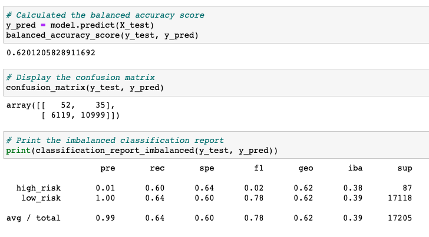

# Credit Risk Analysis

## Overview:
This project tests my skills in data preparation, statistical reasoning, and machine learning to solve a real-world challenge: credit card risk. Utilizing different techniques to train and evaluate models with unbalanced classes, after carefully analyzing the performance of these models I recommend --- should be used to predict credit risk. All analysis is written in Python. 

---
### Resources:
* Source Code: [Credit Risk Ensemble](credit_risk_ensemble.ipynb), [Credit Risk Resampling](credit_risk_resampling.ipynb)
* Source Data: [Loan Stats](LoanStats_2019Q1.csv)
* Software: [Scikit-Learn](https://scikit-learn.org/stable/), [Imbalanced-Learn](https://imbalanced-learn.org/stable/index.html)

---
### Deliverables:
- [x] Deliverable 1: Use Resampling Models to Predict Credit Risk
- [x] Deliverable 2: Use the SMOTEENN Algorithm to Predict Credit Risk
- [x] Deliverable 3: Use Ensemble Classifiers to Predict Credit Risk
- [x] Deliverable 4: Write Credit Risk Analysis

---
### RandomOverSampler:

    *Accuracy Score
    *Confusion Matrix
---
### SMOTE:

    *Accuracy Score
    *Confusion Matrix
---
### ClusterCentroids:

    *Accuracy Score
    *Confusion Matrix

---
### SMOTEENN Algorithm:

    *Accuracy Score
    *Confusion Matrix

---
### BalancedRandomForestClassifier:

   
    *Accuracy Score
    *Confusion Matrix
---
### EasyEnsembleClassifier:

   
    *Accuracy Score
    *Confusion Matrix

---
### Credit Risk Analysis:
Overview of the analysis: Explain the purpose of this analysis.

Results: Using bulleted lists, describe the balanced accuracy scores and the precision and recall scores of all six machine learning models. Use screenshots of your outputs to support your results.

Summary: Summarize the results of the machine learning models, and include a recommendation on the model to use, if any. If you do not recommend any of the models, justify your reasoning.